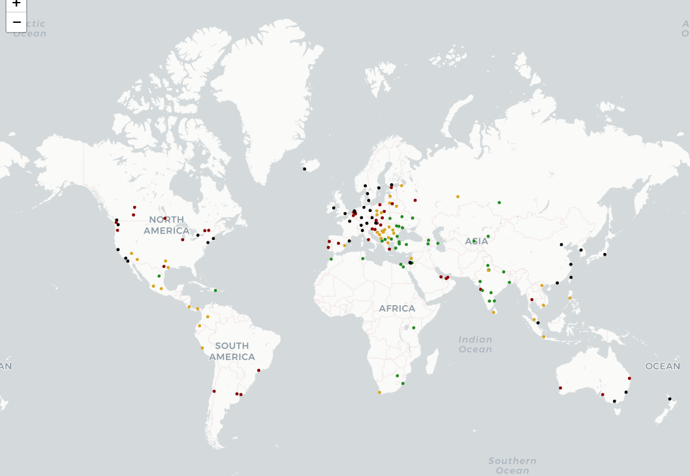

# Cost of living EDA


## install libraries

```python
pip3 install folium
pip3 install geopandas
pip3 install opencage
```
* Using OpenCage to Retrieve Latitude and Longitude

```python
def color_producer(val):
    if val <= df[item].quantile(.25):
        return 'forestgreen'
    elif val <= df[item].quantile(.50):
        return 'goldenrod'
    elif val <= df[item].quantile(.75):
        return 'darkred'
    else:
        return 'black'
```
* A Function called "color_producer"  takes a numerical value val as its input and assigns a color based on its relationship to the quantiles of a DataFrame column (df[item]). The colors are chosen in a way that reflects different ranges of the data distribution.


## Analysis & Visualizations
* It looks like Switzerland, Iceland, and Norway are the most expensive of places. This can be confirmed by looking at the data below.

* It's also clear that Europe and North America are some of the most expensive places on Earth.


*All_prices_normalized_for_each_Country*

# Visualizition Analysis



*Price per Square Meter to Buy Apartment Outside of Centre*


*Average Monthly Net Salary (After Tax)*

Group the cities by country using the mean of all the columns. This will give a much clearer overview when looking at the map, when trying to detect any trends.


*Mapping Everything!*


# Further Analysis
Some further areas I would like to expore in a future notebook would be:

* Grouping columns by similarity. Which places are more expensive for food vs. accomodation.
* Outliers. Which places are much cheaper or expensive for particular things, and exploring possible reasons for these.
* Exploring the correlation between how much things cost and their countries GDP.

